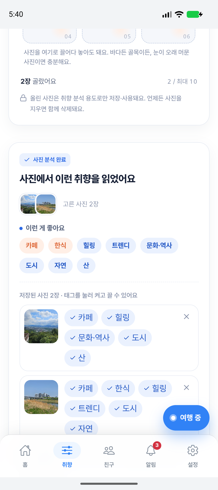
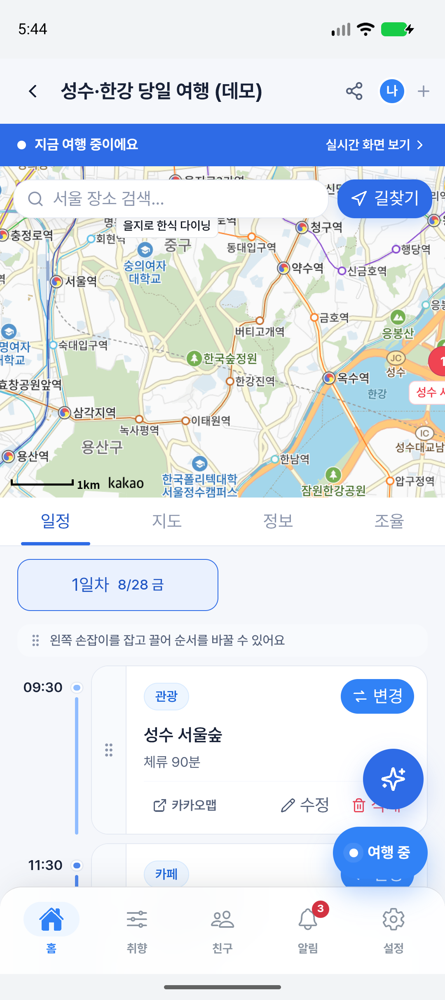
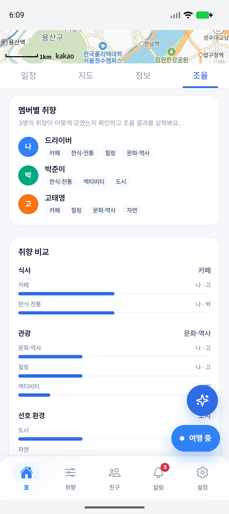
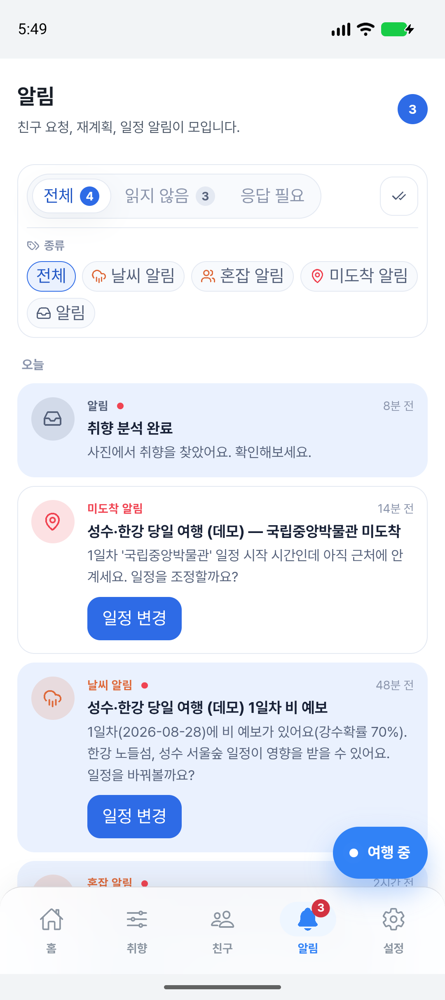
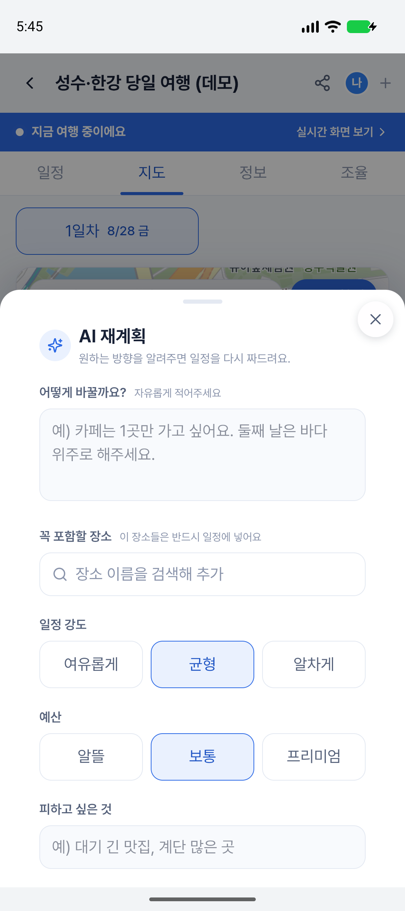
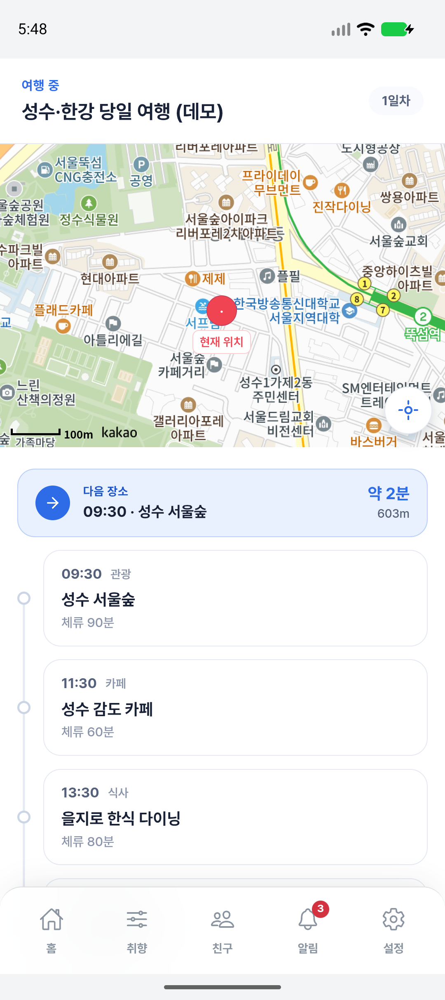
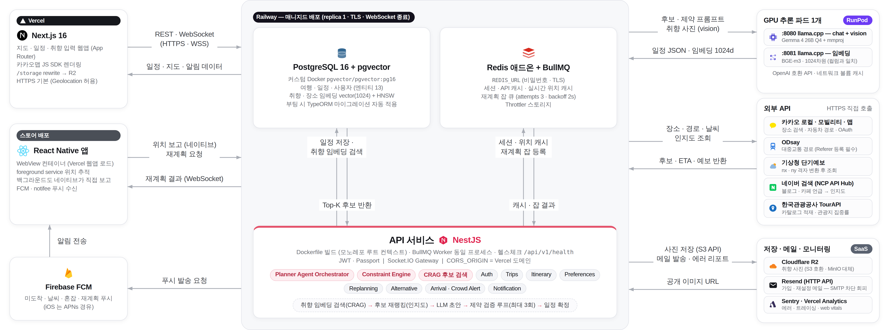
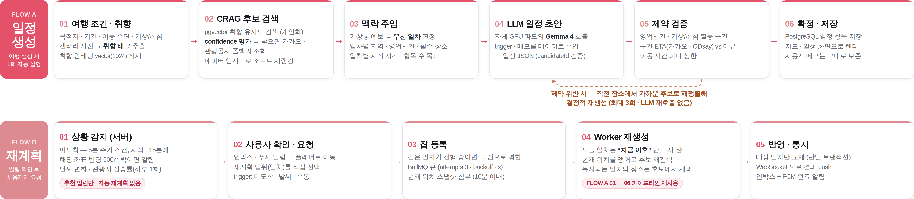
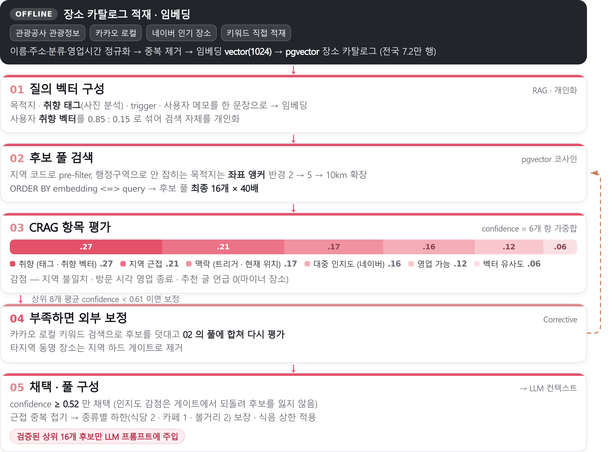

<div align="center">


# TriPick

**Trip + Pick — 취향으로 골라주는 AI 여행 플래너 에이전트**

사진 몇 장으로 취향을 읽고, 국내 여행 일정을 짜 주고,<br />
여행 중 상황이 바뀌면 알려주는 여행 플래너.

[](https://github.com/pnucse-capstone2026/capstone-2026-team-34/actions/workflows/ci.yml)
[](../../LICENSE)
[](https://nextjs.org)
[](https://nestjs.com)
[](https://reactnative.dev)
[](https://github.com/pgvector/pgvector)

<br />

### 라이브 서비스

[](https://tripick.place)

<sub>브라우저에서 바로 사용할 수 있고, WebView 앱과 같은 화면이다.</sub>

</div>

---

## 목차

- [소개](#소개)
- [화면](#화면)
- [주요 기능](#주요-기능)
- [아키텍처](#아키텍처)
- [동작 흐름](#동작-흐름)
- [취향 기반 후보 검색 (RAG / CRAG)](#취향-기반-후보-검색-rag--crag)
- [기술 스택](#기술-스택)
- [프로젝트 구조](#프로젝트-구조)
- [시작하기](#시작하기)
- [스크립트](#스크립트)
- [테스트 · CI](#테스트--ci)
- [배포](#배포)
- [문서](#문서)
- [라이선스](#라이선스)

---

## 소개

여행 계획의 진짜 비용은 "어디를 갈지"가 아니라 **내 취향에 맞는 곳을 찾아 시간표로 엮는 일**이다.
TriPick 은 그 과정을 세 가지로 나눠 자동화한다.

- **취향을 말이 아니라 사진으로 받는다** — 갤러리 사진을 vision 모델로 분석해 음식·무드·자연/도시 태그를 뽑고, 임베딩으로 저장해 검색 자체를 개인화한다.
- **일정을 규칙이 아니라 제약으로 만든다** — 영업시간·이동시간·취침/기상 시간을 통과할 때까지 결정적으로 재정렬한다. LLM 초안이 제약을 어기면 다시 부르지 않고 근접 후보로 재배치한다.
- **여행 중에는 자동으로 바꾸지 않고 알려준다** — 미도착·날씨·혼잡은 전부 "추천 알림"까지만 간다. 실제 재계획은 사용자가 확인하고 요청할 때만 돈다.

LLM 추론은 외부 API 가 아니라 **자체 GPU 파드에서 서빙하는 Gemma 4 + llama.cpp** 로 돌린다 (OpenAI 호환 인터페이스).

## 화면

|                                    ① 취향 사진 → 태그 추출                                    |                                    ② 생성된 일정 · 동선                                    |                                  ③ 동행 취향 조율                                   |
| :-------------------------------------------------------------------------------------------: | :----------------------------------------------------------------------------------------: | :---------------------------------------------------------------------------------: |
|  |  |  |

|                            ④ 미도착 · 날씨 · 혼잡 알림                             |                                      ⑤ 재계획 요청                                      |                                ⑥ 여행 진행 · 다음 장소 ETA                                |
| :--------------------------------------------------------------------------------: | :-------------------------------------------------------------------------------------: | :---------------------------------------------------------------------------------------: |
|  |  |  |

## 주요 기능

| 기능                     | 설명                                                                                             |
| ------------------------ | ------------------------------------------------------------------------------------------------ |
| **취향 사진 분석**       | 갤러리 사진 → vision 모델 → 음식·무드·자연/도시 태그 → pgvector 임베딩                           |
| **AI 일정 생성**         | 목적지·기간·이동 수단·취침/기상 시간을 받아 일차별 타임라인 생성                                 |
| **RAG / CRAG 후보 검색** | 전국 7만여 행 장소 카탈로그에서 취향 유사도로 후보를 뽑고, confidence 가 낮으면 외부 API 로 보정 |
| **제약 검증 루프**       | 영업시간·구간 ETA·활동 가능 시간 검증, 위반 시 근접 후보로 결정적 재생성 (최대 3회)              |
| **부분 재계획**          | 일차 단위로 다시 짜고 나머지 일차는 보존. 오늘 일차는 "지금 이후"만 다시 짠다                    |
| **미도착 알림**          | 항목 시작 시각 + 15분에 현재 위치가 반경 500m 밖이면 inbox + 푸시                                |
| **날씨 · 혼잡 알림**     | 기상청 단기·중기예보, 관광공사 관광지 집중률 기반 일정 조정 추천                                 |
| **실시간 반영**          | Socket.IO 로 재계획 결과 push, FCM/APNs 로 푸시 알림                                             |
| **친구 · 동행**          | 친구 초대, 동행 취향 조율, 참여자 일정 변경에 대한 owner 승인                                    |

## 아키텍처

<picture>
  <source media="(prefers-color-scheme: dark)" srcset="../../assets/diagrams/architecture-dark.png" />
  
</picture>

| 레이어          | 구성                                                                           |
| --------------- | ------------------------------------------------------------------------------ |
| **Client**      | React Native 앱 (WebView 컨테이너 · 위치 추적 · FCM) + Next.js 웹앱            |
| **API**         | NestJS — REST + Socket.IO Gateway, JWT/Passport, BullMQ Worker 동일 프로세스   |
| **AI Agent**    | Planner Orchestrator (툴 조율 · 프롬프트 구성 · JSON 검증) + Constraint Engine |
| **LLM Serving** | 자체 GPU 파드 — llama.cpp 2개 (chat+vision / 임베딩), OpenAI 호환 API          |
| **Data**        | PostgreSQL 16 + pgvector, Redis (캐시·세션·잡 큐), S3 호환 오브젝트 스토리지   |
| **External**    | 카카오 (로컬·모빌리티·맵·OAuth), ODsay, 기상청, 한국관광공사, 네이버 검색      |

> 툴 오케스트레이션은 LLM 이 툴을 고르는 agentic 라우팅이 아니라 **코드가 정한 결정적 순서**다.
> LLM 은 후보와 제약이 다 갖춰진 상태에서 일정 초안 하나만 만든다.

## 동작 흐름

<picture>
  <source media="(prefers-color-scheme: dark)" srcset="../../assets/diagrams/flow-dark.png" />
  
</picture>

- **FLOW A (일정 생성)** — 취향/조건 → CRAG 후보 검색 → 맥락 주입 → LLM 초안 → 제약 검증 → 저장
- **FLOW B (재계획)** — 서버가 상황을 감지해 알림 → 사용자가 확인·요청 → BullMQ 잡 → FLOW A 재사용 → WebSocket + 인박스 통지

경로 이탈·날씨·혼잡 어느 것도 **자동 재계획을 트리거하지 않는다.** 알림까지만 가고, 재계획은 사용자의 선택이다.

## 취향 기반 후보 검색 (RAG / CRAG)

<picture>
  <source media="(prefers-color-scheme: dark)" srcset="../../assets/diagrams/rag-crag-dark.png" />
  
</picture>

pgvector 유사도만으로는 마이너 장소가 상위를 채운다. 그래서 confidence 를 6개 항의 가중합으로 계산하고
(취향 · 지역 근접 · 맥락 · 대중 인지도 · 영업 가능 · 벡터 유사도), 기준에 못 미치면 카카오 로컬로 후보를 덧대 다시 평가한다.
인지도 감점은 후보를 **제거하지 않고 순위만 낮춘다** — 개인화를 죽이지 않기 위한 소프트 재랭킹이다.

각 노브의 값과 근거는 [docs/preference](../preference) 아래 문서에 스윕 결과와 함께 고정돼 있다.

## 기술 스택

| 영역               | 사용 기술                                                                                             |
| ------------------ | ----------------------------------------------------------------------------------------------------- |
| **Frontend (Web)** | Next.js 16 (App Router) · React 19 · TypeScript 6 · Tailwind CSS 4 · TanStack Query · 카카오맵 JS SDK |
| **Frontend (App)** | React Native 0.85 · react-native-webview · Firebase Messaging · notifee · Geolocation                 |
| **Backend**        | NestJS 11 · TypeORM · Passport/JWT · Socket.IO · BullMQ · Swagger                                     |
| **AI / ML**        | Gemma 4 (llama.cpp, chat + vision) · BGE-m3-ko 임베딩 (1024d) · RAG / CRAG                            |
| **Data**           | PostgreSQL 16 + pgvector (HNSW) · Redis 7 · S3 호환 스토리지 (MinIO / R2)                             |
| **Infra**          | Turborepo + pnpm workspace · Docker Compose · GitHub Actions · Vercel · Railway · RunPod              |
| **모니터링**       | Sentry · Vercel Analytics                                                                             |

## 프로젝트 구조

```
tripick/
├── apps/
│   ├── api/          # NestJS — auth · trips · itinerary · planner · replanning · alerts
│   ├── web/          # Next.js 웹앱 (FSD: app / views / widgets / features / entities / shared)
│   └── mobile/       # React Native WebView 셸 (위치 · 푸시 · 딥링크)
├── packages/
│   ├── types/        # FE·BE 공유 DTO·타입
│   └── utils/        # 기상청 격자 변환 등 공통 유틸
├── infra/
│   ├── postgres/     # init.sql (pgvector 확장 · 벡터 컬럼)
│   └── runpod/       # GPU 추론 파드 Dockerfile · 기동 스크립트
├── docs/             # 기능별 결정·근거·검증 문서 (docs/README.md 인덱스)
├── assets/           # 브랜드 · 다이어그램 · 스크린샷
└── docker-compose.yml
```

## 시작하기

### 요구 사항

- Node.js 20 (`.nvmrc`)
- pnpm 9 (`corepack enable`)
- Docker (PostgreSQL · Redis · MinIO · Mailpit)

### 설치 · 실행

```bash
git clone https://github.com/pnucse-capstone2026/capstone-2026-team-34.git
cd capstone-2026-team-34

corepack enable
pnpm install

# 환경변수 준비
cp apps/api/.env.example apps/api/.env
cp apps/web/.env.example apps/web/.env

# 인프라 기동 + 웹·API 동시 실행 (http://localhost:3000)
pnpm start
```

`pnpm start` 는 `pnpm db:up` (Docker 인프라) 후 `turbo run dev` 로 web·API 를 함께 띄운다.
인프라만 따로 올리려면 `pnpm db:up`, 내리려면 `pnpm db:down`.

개발 모드에서는 TypeORM `synchronize` 로 스키마가 자동 반영돼 별도 마이그레이션 실행이 필요 없다.
MinIO 버킷이 없다는 에러가 나면 `docker compose up minio-init` 을 한 번 돌린다.

### 포트

| 서비스        | 주소                                                |
| ------------- | --------------------------------------------------- |
| Web (Next.js) | http://localhost:3000                               |
| API (NestJS)  | http://localhost:4000/api/v1 (Swagger: `/api/docs`) |
| PostgreSQL    | localhost:5432 (`tripick` / `tripick`)              |
| Redis         | localhost:6379                                      |
| MinIO         | http://localhost:9000 (콘솔 :9001)                  |
| Mailpit       | http://localhost:8025                               |

### 외부 API 키

키 없이도 앱은 뜬다 — 해당 기능만 폴백으로 동작한다. 전체 기능을 보려면 `apps/api/.env` 에 채운다.

| 키                                           | 용도                           | 없을 때                      |
| -------------------------------------------- | ------------------------------ | ---------------------------- |
| `KAKAO_REST_API_KEY` · `KAKAO_LOCAL_API_KEY` | 장소 검색, 자동차 경로, OAuth  | 시드 후보 · 직선거리 추정    |
| `NEXT_PUBLIC_KAKAO_MAP_KEY`                  | 웹 지도 렌더링                 | 지도 미표시                  |
| `ODSAY_API_KEY` · `ODSAY_SERVICE_URL`        | 대중교통 경로                  | 직선거리 추정 폴백           |
| `KMA_API_KEY`                                | 기상청 단기예보                | 날씨 카드·알림 비활성        |
| `KTO_API_KEY`                                | 관광공사 관광정보 적재, 집중률 | 카탈로그 적재 불가           |
| `NAVER_SEARCH_CLIENT_ID` · `_SECRET`         | 대중 인지도 재랭킹             | 인지도 항 중립값 (랭킹 불변) |
| `FIREBASE_*`                                 | FCM 푸시                       | 인박스만 동작                |

### 로컬 LLM

일정 생성·취향 사진 분석·임베딩은 OpenAI 호환 엔드포인트를 호출한다. 기본값은 로컬 llama.cpp 다.

```bash
# chat + vision (mmproj 포함)
llama-server -m gemma-4-26b-q4.gguf --mmproj mmproj.gguf --port 8080

# 임베딩 (BGE-m3-ko, 1024차원 — pgvector 컬럼과 일치해야 함)
llama-server -m bge-m3-ko.gguf --embedding --port 8081
```

서버가 없으면 `LLM_PLANNER_ENABLED=false` 로 두면 된다. 규칙 기반 폴백 플래닝으로 일정이 생성된다.

## 스크립트

| 명령                                        | 설명                                                     |
| ------------------------------------------- | -------------------------------------------------------- |
| `pnpm start`                                | 인프라 기동 + web·API dev 실행                           |
| `pnpm dev`                                  | web·API dev 실행 (인프라 제외)                           |
| `pnpm dev:android` / `dev:ios`              | React Native 앱 실행                                     |
| `pnpm build` / `lint` / `test`              | Turborepo 전체 태스크                                    |
| `pnpm --filter @tripick/api ingest:places`  | 장소 카탈로그 적재 (KTO · 카카오 · 네이버)               |
| `pnpm --filter @tripick/api eval:retrieval` | 골든셋 검색 품질 평가 (`--sweep=KEY=v1,v2` 로 노브 스윕) |
| `pnpm --filter @tripick/api seed:demo-live` | 데모 여행 데이터 시드                                    |
| `pnpm --filter @tripick/api migration:run`  | 마이그레이션 적용 (배포 환경용)                          |

## 테스트 · CI

PR 마다 GitHub Actions 에서 세 잡이 돈다.

- **verify** — 빌드 · 타입체크 · 린트 · 유닛 테스트 (turbo 캐시 미사용)
- **e2e** — HTTP 계약 · 인가 경계 (pgvector 컨테이너)
- **migrations** — 빈 DB 에 up → 재실행 no-op → revert → up

```bash
pnpm test                                   # 전체 유닛
pnpm --filter @tripick/api test:e2e         # e2e (DB 필요)
pnpm --filter @tripick/api test:integration # 로컬 LLM 필요
```

## 배포

| 대상                              | 플랫폼          |
| --------------------------------- | --------------- |
| `apps/web`                        | Vercel          |
| `apps/api` + PostgreSQL + Redis   | Railway         |
| LLM 추론 (chat · vision · 임베딩) | RunPod GPU 파드 |
| 오브젝트 스토리지                 | Cloudflare R2   |
| 메일                              | Resend          |

전환 절차와 환경변수 대응표는 [docs/ops/deployment-railway-vercel-runpod.md](../ops/deployment-railway-vercel-runpod.md) 참고.

## 문서

기능 단위로 **결정 · 근거 · 검증**을 고정한 문서를 둔다. 인덱스는 [docs/README.md](../README.md).

- [docs/overview/product-v1-scope.md](../overview/product-v1-scope.md) — 제품 범위
- [docs/setup/setup.md](../setup/setup.md) — 로컬 셋업
- [docs/planner/rag-crag-v1.md](../planner/rag-crag-v1.md) — RAG / CRAG 파이프라인
- [docs/alerts](../alerts) — 미도착 · 날씨 · 혼잡 알림
- [docs/auth](../auth) — 인증 · 세션 · 보안 하드닝

## 라이선스

[MIT](../../LICENSE) © PNUKoZune
