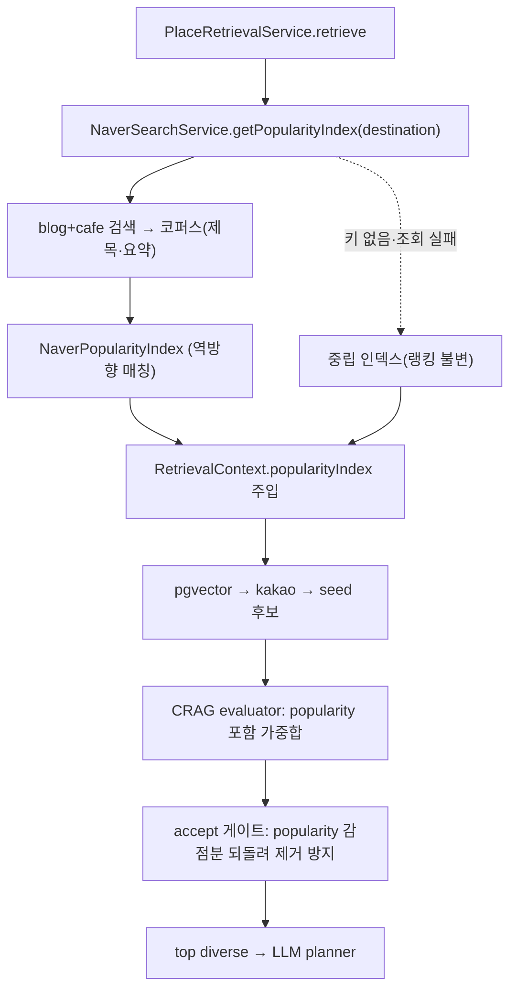

# 네이버 추천 글 대중 인지도 신호 v1

문서 목적: 여행 생성/재계획 후보가 취향만 반영해 마이너 장소가 과다하게 나오는 문제를, 네이버 블로그·카페 "추천 글"의 대중 인지도로 보정한 작업을 고정한다.

기준 브랜치: `feat/naver-popularity-signal`
작성일: 2026-07-23
관련 문서: [`docs/planner/rag-crag-v1.md`](./rag-crag-v1.md) (CRAG 파이프라인), [`CLAUDE.md`](../../CLAUDE.md) 6절 (네이버 검색 API 주의사항)

커밋: `47cd1c6`(인지도 신호) → `56c0342`(regionStem 도 유지) → `86738a0`(리뷰 3건) → `c844012`(서브지역 반영) → `6dd734d`(기관 수식어 코어) → `2ca6588`(CLAUDE.md) → `5f6a08b`(regionPrefixStem)

## 1. 범위 · 문제

CRAG 후보는 pgvector 취향 유사도로 개인화된다([rag-crag-v1](./rag-crag-v1.md)). 취향 신호가 강할수록 남들이 잘 안 가는 **마이너 장소**까지 상위에 올라와, "그 지역에서 실제로 많이 가는 곳"이라는 감각과 어긋났다.

해결: 검색 **앞단**에서 네이버 블로그·카페의 `"OO 여행지 추천"` 글을 모아 대중 인지도(popularity) 신호를 만들고, CRAG 랭킹에 가중항으로 더한다. 취향 개인화는 그대로 두고 그 위에 얹는 **소프트 재랭킹**이다 — 마이너 장소를 후순위로 밀 뿐 제거하지 않는다.

집중률(`crowd_alert`)·날씨가 플래닝 점수에 미반영인 것과 달리, 인기도는 **점수에 반영**한다(마이너 과다가 곧 점수 문제라서).

## 2. 구현 파일

| 파일 | 역할 |
| --- | --- |
| `apps/api/src/planner/retrieval/naver-search.service.ts` | **신규**. blog+cafe 검색(NCP API Hub) → 코퍼스 → `NaverPopularityIndex`. 목적지별 TTL 캐시 |
| `apps/api/src/planner/retrieval/place-retrieval.service.ts` | 앞단에서 인지도 인덱스 조회 → 랭킹 컨텍스트 주입. accept 게이트에 소프트 보정 |
| `apps/api/src/planner/retrieval/crag-evaluator.service.ts` | `popularity` 가중항(0.12) 추가, `POPULARITY_WEIGHT` 상수 export |
| `apps/api/src/planner/retrieval/types.ts` | `PopularityIndex` 인터페이스, `RetrievalContext.popularityIndex`, `CragScore.popularity` |
| `apps/api/src/planner/retrieval/place-seeds.ts` | 어간 함수 3분화(`regionStem`/`regionSearchStem`/`regionPrefixStem`) |
| `apps/api/src/planner/retrieval/place-embedding.repository.ts` | LIKE 프리픽스를 `regionPrefixStem`으로 교체(recall 복원) |
| `apps/api/src/main-planner/destinations.service.ts` | 표시 라벨을 매칭용 어간과 분리 |
| `apps/api/src/planner/planner.module.ts` | `NaverSearchService` 등록 |
| `apps/api/test/planner/retrieval/naver-search.service.spec.ts` | **신규**. 인덱스 매칭·캐시·부분실패·수식어 코어 fixture |
| `apps/api/test/planner/retrieval/{crag-evaluator,place-retrieval,place-seeds}.service.spec.ts` | popularity 재랭킹·게이트·어간 fixture |

## 3. 실행 흐름



## 4. 역방향 매칭 (핵심 결정)

블로그 텍스트에서 장소명을 **추출**(한글 NER)하는 건 불안정하다. 대신 이미 깨끗한 후보 `name`이 코퍼스에 **몇 번 나오는지 카운트**한다. 마이너 장소는 자연히 언급 0으로 걸러진다.

- 공백 제거 비교로 띄어쓰기 차이 흡수(`동궁과 월지` = `동궁과월지`).
- 1글자명은 오탐이 심해 제외.
- **기관 수식어 코어 폴백**: 정식명이 블로그 표현보다 길면(`국립경주박물관` vs `경주박물관`) 놓친다. `국립·도립·시립·공립·사립`을 뗀 코어로 매칭하되, 코어 4자 이상일 때만 적용해 `도서관`·`극장` 같은 일반어 오탐을 막는다.

점수 곡선(`NaverPopularityIndex.score`):

| 언급 수 | popularity |
| ---: | ---: |
| 0 | 0.15 (소프트 감점) |
| 1 | 0.63 |
| 2 | 0.74 |
| 4 | 0.87 |
| 비활성(키 없음/실패) | 0.50 (중립) |

## 5. CRAG 반영 · 소프트 재랭킹 보장

`popularity` 항을 0.12 가중으로 추가하고 나머지 6항을 재정규화(합 1.0).

| 항목 | 가중치 |
| --- | ---: |
| retrieval | 0.24 |
| taste | 0.20 |
| **popularity** | **0.12** |
| locality | 0.16 |
| context | 0.13 |
| availability | 0.09 |
| data quality | 0.06 |

**"소프트"의 함정과 수정**: popularity 감점(언급0 → 중립 대비 약 −0.042)이 `CRAG_MIN_CONFIDENCE`(0.52) 임계선을 넘겨 후보를 accept 목록에서 탈락 → `finalPool`에서 **제거**될 수 있었다. accept 게이트에서만 중립값 아래 감점분을 되돌려(`POPULARITY_WEIGHT × max(0, 0.5 − popularity)`) 인기도만으로는 제거되지 않게 하고, 정렬 순서엔 감점을 그대로 반영한다. 즉 순위는 낮추되 풀에서 빼지 않는다.

비활성(키 없음/조회 실패)이면 popularity=중립 0.5라 모든 후보에 상수만 더해져 **순위가 변하지 않는다**(kakao와 동일한 그레이스풀 패턴).

## 6. 어간 함수 3분화

목적지 문자열 정규화가 용도별로 요구가 달라 `place-seeds.ts`에서 셋으로 나눴다.

| 함수 | 용도 | `경기도` | `부산 해운대` |
| --- | --- | --- | --- |
| `regionStem` | tats 시도 area code 키(빌드·조회 대칭) | `경기도` | `부산` |
| `regionSearchStem` | 네이버 검색 질의·캐시 키(**서브지역 보존**) | `경기도` | `부산 해운대` |
| `regionPrefixStem` | pgvector LIKE 프리픽스(**최단**, 도까지 제거) | `경기` | `부산` |

- `regionStem`은 도를 유지(특별자치도→도)하되, 그 출력은 사용자에게 노출되지 않는다.
- 표시 라벨(`displayRegionName`)은 위 어간과 분리해 자체 strip — 슬러그 `jeju`와 시도명 `제주특별자치도`를 모두 `제주`로 맞춰 후보 그룹 분리를 막는다.
- `regionPrefixStem`은 `경기%`로 짧은 라벨(`경기`)·풀네임(`경기도`)을 함께 잡아 province-level pgvector recall을 복원한다.

## 7. 환경 변수

```env
# 비워두면 인지도 항이 중립값이 되어 후보 랭킹이 바뀌지 않는다(그레이스풀 비활성)
NAVER_SEARCH_CLIENT_ID=
NAVER_SEARCH_CLIENT_SECRET=
NAVER_SEARCH_DISPLAY=30            # 검색어당 blog·cafe 각각 문서 수 (1~100)
NAVER_SEARCH_CACHE_TTL_HOURS=6     # 목적지별 코퍼스 캐시 TTL
```

인증은 헤더 `X-NCP-APIGW-API-KEY-ID`(Client ID) + `X-NCP-APIGW-API-KEY`(Secret). 엔드포인트는 NCP API Hub(`naverapihub.apigw.ntruss.com/search/v1/{blog,cafearticle}`) — 구 `openapi.naver.com` 아님.

## 8. 검증

```bash
corepack pnpm --filter @tripick/api typecheck   # tsc 클린
corepack pnpm --filter @tripick/api test         # 405 통과
corepack pnpm --filter @tripick/api lint         # 클린
```

실키 라이브 호출 확인:

- blog·cafe 둘 다 HTTP 200, 실데이터 반환.
- 경주 코퍼스(180 docs)에서 유명 장소 부스트 / 마이너 감점: 황리단길 58·첨성대 18·대릉원 18·불국사 15 → popularity 1.0, 무명 카페 0 → 0.15.
- 서브지역 구분: `부산 해운대` 코퍼스는 해운대해수욕장 30·스카이캡슐 8, `부산 광안리`는 광안리해수욕장 51·해운대 랜드마크 0.
- 수식어 코어: `국립경주박물관` 정식명 14 → 코어 `경주박물관` 17로 개선.

테스트 fixture:

| fixture | 검증 내용 |
| --- | --- |
| 인덱스 매칭 | 언급 빈도 카운트, 띄어쓰기 흡수, 1글자명 무시 |
| 기관 수식어 코어 | `국립경주박물관`→코어 `경주박물관` 매칭 / `시립도서관`→짧은 코어 오탐 방지 |
| 캐시·부분 실패 | 목적지 재조회 시 HTTP 미호출, blog/cafe 한쪽 실패해도 나머지 유지 |
| 그레이스풀 비활성 | 키 없음/실패 시 중립 인덱스 → 랭킹 불변 |
| CRAG 재랭킹 | 언급된 유명 후보가 미언급 마이너 후보보다 상위, `naver-unmentioned` 페널티 |
| 어간 3종 | `regionSearchStem` 서브지역 보존, `regionPrefixStem` 도 제거 최단 |
