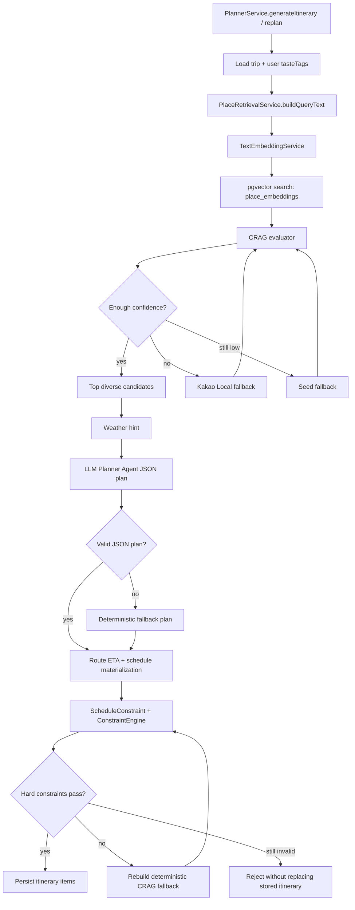

# TriPick RAG / CRAG planner v1

문서 목적: 착수보고서의 RAG/CRAG 목표를 실제 API planner 파이프라인에 연결한 작업을 고정한다.

기준 브랜치: `feat/rag-crag-planner`
작성일: 2026-06-30

## 1. 목적

착수보고서의 RAG/CRAG 목표를 실제 API planner 파이프라인에 연결한다.

- 사용자 취향 태그와 여행 목적지를 검색 질의로 구성한다.
- `place_embeddings`의 pgvector 유사도 검색으로 후보 장소를 가져온다.
- 검색 confidence가 낮거나 후보가 부족하면 Kakao Local API, seed catalog 순서로 fallback한다.
- CRAG evaluator가 후보를 점수화하고 낮은 품질 후보를 제거 또는 후순위로 보정한다.
- 최종 후보를 OpenAI-compatible LLM planner agent에 전달해 JSON 일정안을 생성한다.
- LLM 응답을 schema 검증한 뒤 route helper, weather helper, constraint engine에 통과시킨다.

즉 LLM이 장소를 추측하지 않고, 검색/도구/제약 검증 결과를 일정 생성의 근거로 사용하도록 만든다.

## 2. 구현 파일

| 파일 | 역할 |
| --- | --- |
| `apps/api/src/planner/retrieval/text-embedding.service.ts` | OpenAI-compatible `/embeddings` 호출. 실패 시 deterministic local embedding으로 fallback |
| `apps/api/src/planner/retrieval/place-embedding.repository.ts` | `place_embeddings` pgvector 검색 및 로컬 seed embedding 주입 |
| `apps/api/src/planner/retrieval/kakao-local.service.ts` | Kakao Local keyword search fallback |
| `apps/api/src/planner/retrieval/crag-evaluator.service.ts` | retrieval, taste, locality, event, availability, data quality 기반 후보 점수화 |
| `apps/api/src/planner/retrieval/place-retrieval.service.ts` | pgvector -> Kakao -> seed 순서의 CRAG orchestration |
| `apps/api/src/planner/retrieval/place-seeds.ts` | 서울/부산/제주/경주/local fallback catalog |
| `apps/api/src/planner/agent/planner-agent.service.ts` | CRAG 후보를 LLM `/chat/completions`에 전달해 JSON 일정안을 생성 |
| `apps/api/src/planner/planner.service.ts` | 기존 seed 후보 선택을 CRAG retrieval + AI planner agent 결과로 교체 |
| `apps/api/src/planner/constraint/constraint.engine.ts` | 영업시간, 기상/취침 범위, 이동시간 gap hard constraint 검증 |
| `apps/api/src/replanning/dto/replan-request.dto.ts` | 재계획 요청 payload 런타임 schema 검증 |
| `apps/api/src/main-planner/dto/main-planner.dto.ts` | 여행 생성/멤버 추가/대안 swap payload 런타임 schema 검증 |
| `apps/api/test/planner/agent/planner-agent.service.spec.ts` | AI planner 호출/LLM fallback fixture 테스트 |
| `apps/api/test/planner/retrieval/crag-evaluator.service.spec.ts` | CRAG evaluator fixture 테스트 |
| `apps/api/test/planner/constraint/constraint-engine.service.spec.ts` | hard constraint fixture 테스트 |
| `apps/api/test/planner/planner.service.spec.ts` | constraint 실패 시 저장 차단/재생성 fixture 테스트 |
| `apps/api/test/replanning/replan-request.dto.spec.ts` | 재계획 DTO validation fixture 테스트 |
| `apps/api/test/main-planner/main-planner.dto.spec.ts` | main planner DTO validation fixture 테스트 |

## 3. 실행 흐름



## 4. CRAG scoring

각 후보는 아래 항목으로 0~1 confidence를 계산한다.

| 항목 | 가중치 | 설명 |
| --- | ---: | --- |
| retrieval | 0.27 | pgvector similarity 또는 source 기본 신뢰도 |
| taste | 0.23 | 사용자 food/mood/environment 태그와 후보 tag overlap |
| locality | 0.18 | 목적지 region/name/address 일치 여부 |
| context | 0.15 | waiting/weather/deviation/manual 이벤트 적합도와 현재 위치 거리 |
| availability | 0.10 | 영업시간이 목표 시간대와 맞는지 |
| data quality | 0.07 | 주소, 좌표, 카테고리, 외부 id 등 필수 메타데이터 완성도 |

기본 threshold:

- `CRAG_MIN_CONFIDENCE=0.52`
- `CRAG_TARGET_CONFIDENCE=0.64`

상위 후보 평균 confidence가 target보다 낮으면 fallback을 수행한다.

## 5. Fallback 정책

1. **pgvector**
   - `place_embeddings.embedding <=> query_embedding` cosine distance 기반 검색
   - 개발 DB가 비어 있으면 `PLACE_RETRIEVAL_AUTO_SEED=true`일 때 seed catalog를 `place_embeddings`에 주입

2. **Kakao Local**
   - `KAKAO_LOCAL_API_KEY` 또는 `KAKAO_REST_API_KEY`가 있을 때만 수행
   - 취향 태그와 이벤트 타입으로 키워드를 확장한다.
   - 예: `부산 cafe`, `부산 근처 카페`, `부산 실내 관광`

3. **Seed fallback**
   - 외부 API와 DB가 모두 비어도 일정 생성이 끊기지 않게 한다.
   - 서울/부산/제주/경주 대표 후보와 default 후보를 제공한다.

## 6. Planner 연동

기존 구조:

```text
PLACE_SEEDS -> pickCandidates -> schedule -> constraint validation
```

변경 후:

```text
PlaceRetrievalService.retrieve
  -> pgvector / Kakao / seed candidates
  -> CRAG evaluator
  -> top diverse candidates
  -> LLM Planner Agent JSON plan
  -> schedule materialization
  -> constraint validation
```

`itinerary_items.memo`에는 AI planner 생성 여부와 추천 근거가 남는다.

예:

```text
선호 태그(cafe, beach) 기준 추천; AI planner 생성: 바다 취향과 카페 선호를 함께 반영; CRAG pgvector confidence 84%;
선호 태그 cafe, beach 일치, pgvector confidence 84%
```

재계획 요청도 같은 retrieval pipeline을 사용한다. `waiting`, `weather`, `deviation`, `manual` trigger에 따라 context score가 달라진다.

Hard constraint 정책:

- LLM plan은 바로 저장하지 않고 `ScheduleConstraint + ConstraintEngine`을 통과해야 한다.
- 검증 항목은 기상/취침 범위, 장소 영업시간, 같은 날 인접 일정 간 이동시간 gap이다.
- LLM plan이 실패하면 CRAG 후보 순위 기반 deterministic fallback으로 재생성한 뒤 다시 검증한다.
- AI plan과 fallback plan이 모두 실패하면 `BadRequestException`으로 거절하고 기존 `itinerary_items`는 replace하지 않는다.
- 재계획/대안 신고 API는 class-validator DTO를 통해 trigger, tripId, 좌표 범위, waitingMinutes 범위를 런타임 검증한다.

## 7. 환경 변수

```env
LLM_BASE_URL=http://localhost:8080/v1
LLM_API_KEY=local
LLM_MODEL=career-agent-planner
LLM_EMBEDDING_MODEL=text-embedding-model
LLM_EMBEDDING_DIMENSIONS=1536
LLM_PLANNER_ENABLED=true
LLM_PLANNER_TIMEOUT_MS=90000
LLM_PLANNER_TEMPERATURE=0.2

KAKAO_LOCAL_API_KEY=
PLACE_RETRIEVAL_AUTO_SEED=true
CRAG_MIN_CONFIDENCE=0.52
CRAG_TARGET_CONFIDENCE=0.64
```

LLM embedding endpoint가 없으면 deterministic local embedding을 사용한다. planner chat endpoint가 없거나 JSON schema 검증에 실패하면 CRAG 순위 기반 deterministic plan으로 fallback한다. 이 fallback은 운영 품질 목적이 아니라, 로컬 개발과 보고서 데모가 외부 모델 상태에 막히지 않게 하기 위한 장치다.

## 8. 검증

실행한 검증:

```bash
corepack pnpm --filter @tripick/types build
corepack pnpm --filter @tripick/api typecheck
corepack pnpm --filter @tripick/api test -- --runInBand
corepack pnpm --filter @tripick/api test:e2e
corepack pnpm --filter @tripick/api build
corepack pnpm --filter @tripick/web typecheck
```

추가 확인:

- 개발 DB의 `place_embeddings` 보조 인덱스 적용 확인
- SWCSS OpenAI-compatible `/models`, `/chat/completions` 실호출 확인
- Kakao Local keyword search 실호출 확인
- 여행 생성 -> AI/CRAG itinerary 저장 -> waiting 재계획 -> Socket.IO `replan_result` push E2E 통과

테스트 fixture:

| fixture | 검증 내용 |
| --- | --- |
| 부산 cafe/beach/romantic 취향 | 서울 후보보다 부산 후보를 상위 랭크 |
| waiting 이벤트 | restaurant보다 대기 친화적인 cafe 후보 우선 |
| 후보 다양화 | cafe 후보가 많아도 attraction 후보를 일정 후보에 포함 |
| AI planner 호출 | CRAG 후보를 `/chat/completions` JSON 일정안으로 변환 |
| AI fallback | LLM 비활성화 시 CRAG 순위 기반 deterministic plan 유지 |
| opening hours 위반 | 영업시간 밖 방문을 hard constraint violation으로 판정 |
| route gap 위반 | ETA보다 짧은 일정 간 buffer를 hard constraint violation으로 판정 |
| wake/sleep 위반 | 기상/취침 범위를 넘는 장시간 일정을 violation으로 판정 |
| invalid AI draft | AI 일정안이 constraint 실패 시 deterministic fallback으로 재생성 후 저장 |
| invalid AI + fallback draft | 모든 생성안이 constraint 실패 시 DB replace 미호출 |
| Replan DTO | 잘못된 trigger, 좌표 범위, waitingMinutes, tripId를 validation error로 차단 |
| Main Planner DTO | 잘못된 여행 생성 날짜/시각/member payload 및 swap itemId 차단 |

## 9. 중간보고서용 구현 현황 문단

본 프로젝트는 기존 rule-based planner의 후보 장소 선택부를 RAG/CRAG 기반 검색 보정 구조로 교체하였다. 사용자 취향 태그와 여행 목적지를 embedding query로 변환하고, PostgreSQL pgvector의 `place_embeddings` 테이블에서 cosine similarity 기반 후보 장소를 검색한다. 검색 결과는 그대로 일정 생성에 사용하지 않고 CRAG evaluator를 통해 취향 일치도, 목적지 일치도, 이벤트 적합성, 영업시간, 데이터 완성도를 점수화한다. 후보 confidence가 낮거나 수가 부족하면 Kakao Local API로 키워드 확장 재검색을 수행하고, 외부 API가 없거나 실패한 경우에는 로컬 seed catalog로 fallback하여 일정 생성이 중단되지 않도록 구성하였다. 최종 후보는 OpenAI-compatible LLM planner agent에 전달되어 day/order/duration/memo 형태의 JSON 일정안으로 생성된다. agent는 제공된 candidate id만 사용할 수 있으며, 응답 JSON은 서버에서 다시 검증한다. LLM이 사용할 수 없거나 schema가 맞지 않으면 CRAG 순위 기반 deterministic fallback으로 일정을 만든다. 이후 weather helper, route helper, schedule constraint, constraint engine을 통과한 뒤 itinerary item으로 저장된다. 이때 기상/취침 범위, 영업시간, 일정 간 이동시간 같은 hard constraint를 위반하면 즉시 저장하지 않고 CRAG fallback으로 재생성하며, 재생성 결과도 실패하면 기존 일정을 교체하지 않는다. 각 일정 memo에는 AI planner 생성 여부, 검색 source, confidence가 남아 추천 근거를 확인할 수 있다. 이를 통해 LLM이 장소 정보를 임의 생성하지 않고 검색 근거와 제약 검증을 기반으로 실행 가능한 일정을 생성하는 AI 여행 플래너 구조를 구현하였다.
